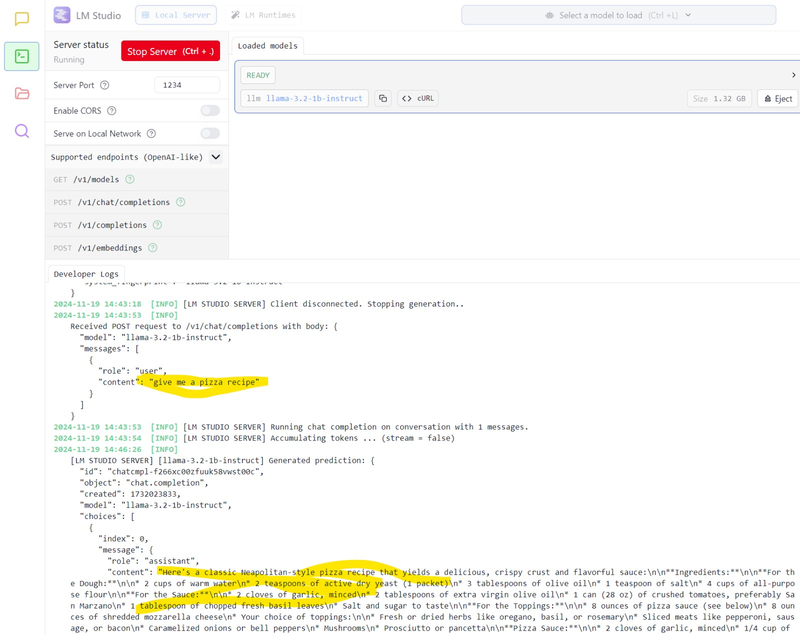

# LLM Chatbot Examples

Dieses Repository enthält zwei Beispiele für die Verwendung von **Language Models (LLMs)** mit lokalem Zugriff über LM Studio. Beide Beispiele zeigen, wie man einfache Benutzerinteraktionen mit LLMs aufbaut, einschließlich der Integration mit APIs und der Übersetzungsunterstützung.

---

## Dateien im Repository

### 1. `llm_chatbot_genai.ipynb`
- **Beschreibung**: Ein einfacher, interaktiver Chatbot, der mit der LM Studio API kommuniziert. Der Bot nimmt Benutzereingaben entgegen, sendet sie an die API, und gibt die Antwort des LLM zurück.
- **Hauptfeatures**:
  - Kommunikation mit LM Studio API.
  - Unterstützung für mehrere Modelle (Standard: `llama-3.2-1b-instruct`).
  - Lokale Ausführung über `http://localhost:1234`.
- **Bildvorschau**:  
  

---

### 2. `user_agent_llm_bot.ipynb`
- **Beschreibung**: Ein Übersetzungsagent, der Haystack verwendet, um die Übersetzung von Texten durch die LM Studio API zu ermöglichen. Der Bot fragt nach Eingabetext und Zielsprache und liefert eine Übersetzung zurück.
- **Hauptfeatures**:
  - Integration mit der LM Studio API für Übersetzungsaufgaben.
  - Nutzung von Haystack Pipelines für strukturierte Verarbeitung.
  - Anpassung der Zielsprachen und kontinuierliche Benutzerinteraktion.
- **Beispielpipeline**:
  - **Eingabe**: Text und Zielsprachencode (z. B. "de" für Deutsch).
  - **Ausgabe**: Übersetzter Text über die API.

---
